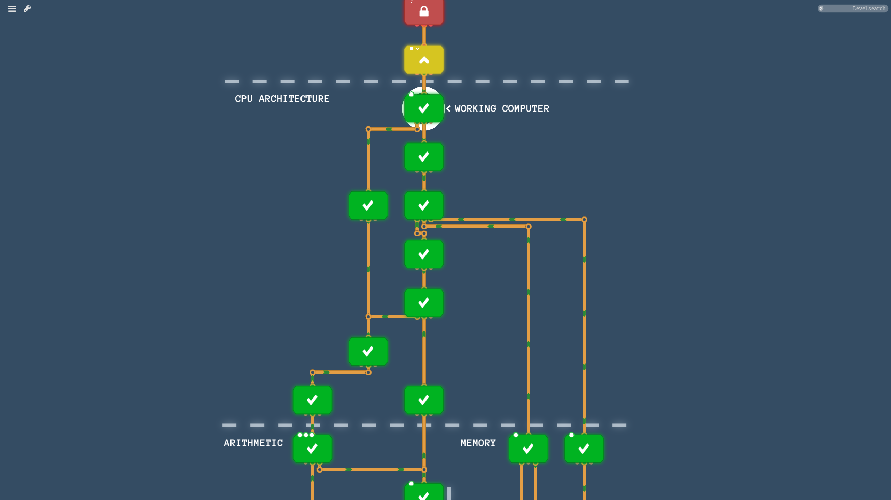
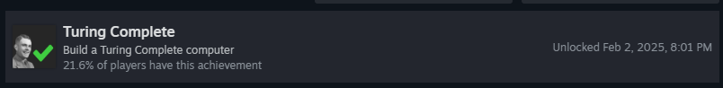

# Introduction

As part of my self-taught learning series, I'm going to be starting from the metal and working my way to learn (and relearn) concepts for how a computer functions. To begin with, I'm going to start with learning assembly and computer architecture.

# Resources

The resources I'm going to be using to learn are:

- Programming from the Ground Up by Jonathan Bartlett
- Turing Complete (Simulation game created by LevelHead)
- nand2tetris

# Goals

- [x] Complete and make a turing complete computer in Turing Complete
    - [x] Complete Overture architecture
    - [ ] Complete LEG architecture

- [x] Complete nand2tetris and get certificate
- [ ] Make a simple game in assembly (breakout, pong, space invaders, etc)
- [ ] Make my own programming language (Will require additional learning)
    - [x] Made my own assembler in nand2tetris for the HACK assembly language
